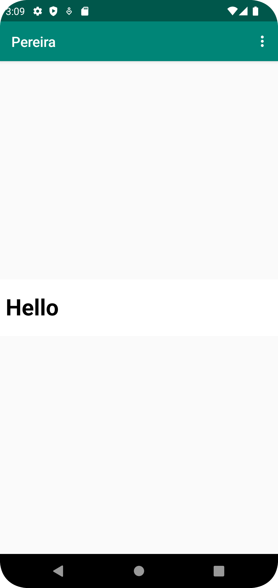

# Rapport

Renamed app name to "Pereira"
Enabled internet access, then created a webview element with the id "my_webview"
Created a webviewclient and enabled javascript.
Added an html page as an asset, which is displayed when selecting "internal web page"
Added "www.google.com" as external web page. 
```
        myWebView = findViewById(R.id.my_webview);
        myWebView.getSettings().setJavaScriptEnabled(true);
        myWebView.loadUrl("file:///android_asset/hello.html");
```

Bilder läggs i samma mapp som markdown-filen.



Läs gärna:

- Boulos, M.N.K., Warren, J., Gong, J. & Yue, P. (2010) Web GIS in practice VIII: HTML5 and the canvas element for interactive online mapping. International journal of health geographics 9, 14. Shin, Y. &
- Wunsche, B.C. (2013) A smartphone-based golf simulation exercise game for supporting arthritis patients. 2013 28th International Conference of Image and Vision Computing New Zealand (IVCNZ), IEEE, pp. 459–464.
- Wohlin, C., Runeson, P., Höst, M., Ohlsson, M.C., Regnell, B., Wesslén, A. (2012) Experimentation in Software Engineering, Berlin, Heidelberg: Springer Berlin Heidelberg.
